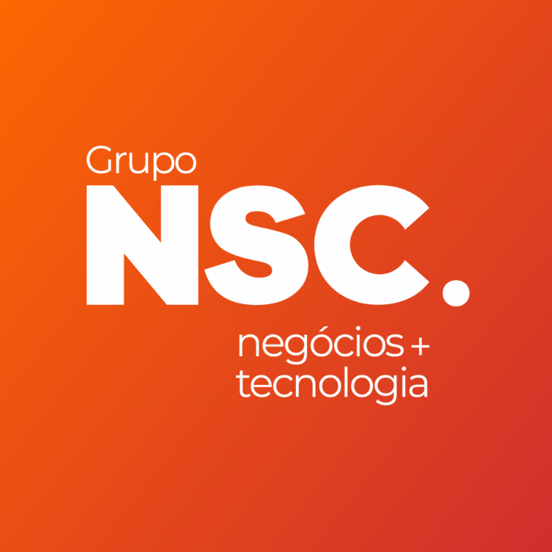

# 👋 &nbsp;Olá mundo!

  Eu sou o Diogo, um <strong>desenvolvedor de software</strong> apaixonado por desafios e soluções tecnológicas de grande impacto.

  Tenho <strong>mais de 2 anos</strong> de experiência com o desenvolvimento de software, tendo a oportunidade de idealizar, planejar e acompanhar o desenvolvimento e evolução de soluções tecnológicas dos mais diversos padrões arquiteturais, transformando sistemas monolíticos em micro-serviços, além de implementar soluções finais em serverless e stateless.

  Durante minha jornada, trabalhei principalmente no desenvolvimento de soluções <strong>white label</strong> nos modelos <strong>B2B</strong> e <strong>B2C</strong>, atuando principalmente com o desenvolvimento de sistemas de pagamento e de <strong>cashback</strong>, para <strong>campanhas promocionais</strong> e de <strong>engajamento</strong> para o varejo físico e online.

# Tecnologias
Tecnologias que utilizo no dia-a-dia de trabalho ou projetos pessoais:

## Frontend

  
  
  
  
  
  
  
  
  

## Backend

  
  
  
  
  
  
  

## Dados
  
  
  
  
  
  
  

## Cloud

  
  
  
  
  

## DevOps

  
  
  
  
  
  
  
  
  
  

## Sistemas operacionais

  
  

 

# Experiência
Experiência de trabalho mais recente:

**Desenvolvedor Full Stack** \
[**Grupo NSC**](https://www.gruponsc.com.br/) • Integral (Remoto) • (2021 - Atualmente)\
Linguagens e Tecnologias: `NodeJS`, `JavaScript`, `TypeScript`, `VueJS`, `MongoDB`, `AWS`, `Docker`\
Projetos em destaque: [NSCPay](https://www.gruponsc.com.br/), [Polgo](https://polgo.com.br/), [QRSorteios](https://www.qrsorteios.com.br/), [CM-PDV/Inteligência do varejo](https://www.gruponsc.com.br/).
 
 

# Onde me encontrar?
  
  
  
  
  

 

### Crétidos da ilustração

**Alzea Arafat**

  
  
  